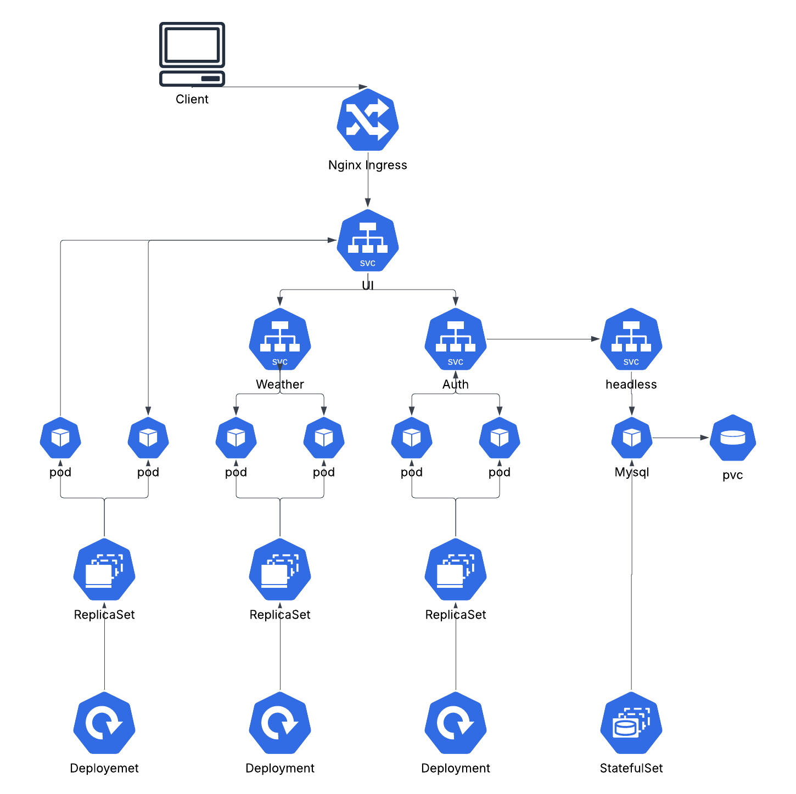
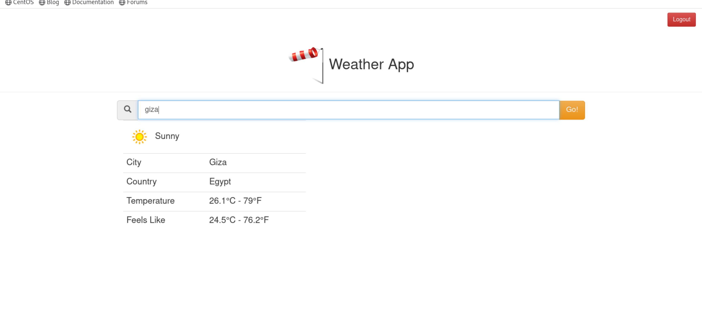

## overveiw
This project is a Weather Application built using a microservices architecture and deployed on a local Kubernetes cluster using kind (Kubernetes in Docker).
The application consists of three main services:
1. UI Service – Frontend application for user interaction
1. Auth Service – Handles user authentication (login/register)
1. Weather Service – Fetches weather data from external APIs

## System Architecture 

## Setup & deploy 
1. clone the repo $git clone https://github.com/ahmddraed/weather-app.git & $cd weather-app
1. create kind cluster from the cluster-config.yaml file by $kind create cluster --config=cluster-config.yaml
1. edit your /etc/hosts file by adding ur localmachine ip refering to www.weatherapp.com 
1. cd to each service and start deploying k8's manifests starting from MYSQL database by $kubectl apply -f 

## Dependencies

1. Docker 
1. Kubernetes (kind)
1. Nginx ingress u can install it by $kubectl apply -f https://raw.githubusercontent.com/kubernetes/ingress-nginx/main/deploy/static/provider/kind/deploy.yaml
